```mermaid
graph TD
    Kiro-Multi-Agent-System[Kiro-Multi-Agent-System<br/>30 modules<br/>2905 LOC]
    style Kiro-Multi-Agent-System fill:#e1f5ff
    flowhunter[flowhunter<br/>10 modules<br/>3179 LOC]
    style flowhunter fill:#e1f5ff
    hermes[hermes<br/>16 modules<br/>3746 LOC]
    style hermes fill:#e1f5ff
    memtxt[memtxt<br/>47 modules<br/>7472 LOC]
    style memtxt fill:#e1f5ff
    morpheus-evolution-lab[morpheus-evolution-lab<br/>9 modules<br/>2300 LOC]
    style morpheus-evolution-lab fill:#e1f5ff
    myhermes[myhermes<br/>148 modules<br/>53676 LOC]
    style myhermes fill:#e1f5ff
    nexus-coder[nexus-coder<br/>0 modules<br/>0 LOC]
    style nexus-coder fill:#e1f5ff
    lib_sys(sys)
    style lib_sys fill:#fff4e1
    myhermes --> lib_sys
    Kiro-Multi-Agent-System --> lib_sys
    morpheus-evolution-lab --> lib_sys
    memtxt --> lib_sys
    flowhunter --> lib_sys
    lib_os(os)
    style lib_os fill:#fff4e1
    myhermes --> lib_os
    Kiro-Multi-Agent-System --> lib_os
    morpheus-evolution-lab --> lib_os
    memtxt --> lib_os
    flowhunter --> lib_os
    lib_json(json)
    style lib_json fill:#fff4e1
    myhermes --> lib_json
    Kiro-Multi-Agent-System --> lib_json
    morpheus-evolution-lab --> lib_json
    memtxt --> lib_json
    flowhunter --> lib_json
    lib_subprocess(subprocess)
    style lib_subprocess fill:#fff4e1
    myhermes --> lib_subprocess
    Kiro-Multi-Agent-System --> lib_subprocess
    morpheus-evolution-lab --> lib_subprocess
    memtxt --> lib_subprocess
    flowhunter --> lib_subprocess
    lib_typing(typing)
    style lib_typing fill:#fff4e1
    myhermes --> lib_typing
    Kiro-Multi-Agent-System --> lib_typing
    morpheus-evolution-lab --> lib_typing
    memtxt --> lib_typing
    flowhunter --> lib_typing
    lib_pathlib(pathlib)
    style lib_pathlib fill:#fff4e1
    myhermes --> lib_pathlib
    Kiro-Multi-Agent-System --> lib_pathlib
    morpheus-evolution-lab --> lib_pathlib
    memtxt --> lib_pathlib
    flowhunter --> lib_pathlib
    lib_time(time)
    style lib_time fill:#fff4e1
    myhermes --> lib_time
    Kiro-Multi-Agent-System --> lib_time
    morpheus-evolution-lab --> lib_time
    memtxt --> lib_time
    flowhunter --> lib_time
    lib_datetime(datetime)
    style lib_datetime fill:#fff4e1
    myhermes --> lib_datetime
    Kiro-Multi-Agent-System --> lib_datetime
    morpheus-evolution-lab --> lib_datetime
    memtxt --> lib_datetime
    hermes --> lib_datetime
    lib_asyncio(asyncio)
    style lib_asyncio fill:#fff4e1
    myhermes --> lib_asyncio
    Kiro-Multi-Agent-System --> lib_asyncio
    morpheus-evolution-lab --> lib_asyncio
    memtxt --> lib_asyncio
    hermes --> lib_asyncio
    lib_enum(enum)
    style lib_enum fill:#fff4e1
    morpheus-evolution-lab --> lib_enum
    myhermes --> lib_enum
    Kiro-Multi-Agent-System --> lib_enum
    hermes --> lib_enum
```

## Statistics
- **Projects:** 7
- **Total modules:** 260
- **Total LOC:** 73,278
- **Cross-project patterns:** 46

## Patterns Found
- **Shared library:** time (used by 5 projects)
- **Shared library:** sys (used by 6 projects)
- **Shared library:** pytest (used by 3 projects)
- **Shared library:** datetime (used by 5 projects)
- **Shared library:** logging (used by 3 projects)
- **Shared library:** os (used by 6 projects)
- **Shared library:** asyncio (used by 5 projects)
- **Shared library:** httpx (used by 2 projects)
- **Shared library:** json (used by 6 projects)
- **Shared library:** subprocess (used by 6 projects)